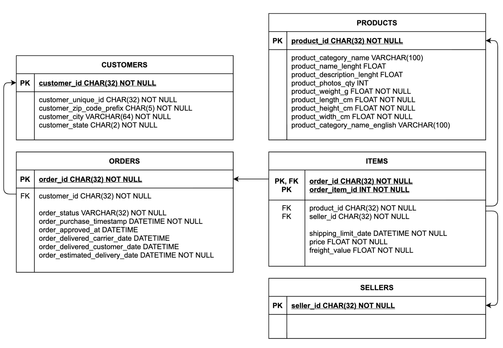

# TECHNICAL TEST : ANALYZE E-COMMERCE DATA


## Introduction

You were recently hired by an E-commerce company. Your mission is to provide insights on sales.

There are four datasets :
* *Products*: a list of available products.
* *Items*: a list of items.
* *Orders*: a list of customer orders on the website.
* *Customers*: a list of customers.

Centralize your projet and code in a Github repository and provide the url once the test is completed.

## To Dos

1. Create and insert data in an local PostgreSQL.
2. Each day we want to compute summary statistics by customers every day (spending, orders etc.)
Create a script to compute for a given day these summary statistics.
3. Run that script over the necessary period to inject historic data. Then, identify the top customers
4. How many customers are repeaters ?
5. Package your script in Docker container so that it can be run each day. We expect a `docker-compose.yml` and a CLI to get stats for a specific day.


## Prerequisites

Make sur you have already installed:
  * [Docker Engine](https://docs.docker.com/get-docker/ "Docker Engine")
  * [Docker Compose](https://docs.docker.com/compose/install/ "Docker Compose")
  * [git](https://git-scm.com/book/en/v2/Getting-Started-Installing-Git "git")

You don’t need to install Python or PostgreSQL, as both are provided by Docker images.

## Setup

* Clone this project and go into
```bash
git clone https://github.com/RomainTL/free2move_technical_test.git
cd free2move_technical_test
```

* Build the image free2move_image
```bash
docker build -t free2move_image .
```

* Start up the application
```bash
docker-compose up -d
```
Warning on mac, you can have this kind of error:
```bash
ATTENTION ERROR: for free2move Cannot start service free2move: Mounts denied:
The path /Users/username/path_to_this_project/free2move_technical_test/data is not shared
from the host and is not known to Docker.
You can configure shared paths from Docker -> Preferences... -> Resources -> File Sharing.
See https://docs.docker.com/docker-for-mac for more info.
ERROR: Encountered errors while bringing up the project.
```
Just follow the instruction of the error and add the necessary path to your shared paths in docker.


## Answers


Answers are written in the docker container in /tmp.  
For example, you can get the answer3 with:
```bash
docker cp free2move_container:/tmp/answer3.csv .
```

### Question 1

```bash
docker exec free2move_container free2move -q 1
```




Check the folder error_data to have more details on invalid data of each table.

### Question 2

```bash
docker exec free2move_container free2move -q 2 -d 2017-01-23
```
Check the file answer/answer2.csv to have more details.

### Question 3

```bash
docker exec free2move_container free2move -q 3 -s 2017-01-23 -e 2017-01-26
```
Check the file answer/answer3.csv to have more details.

### Question 4

```bash
docker exec free2move_container free2move -q 4
```
Check the file answer/answer4.txt to have more details.


## What remains to be done in free2move
  * add environment variables
  * add custom error
  * add documentation
  * add docstrings
  * add tests
